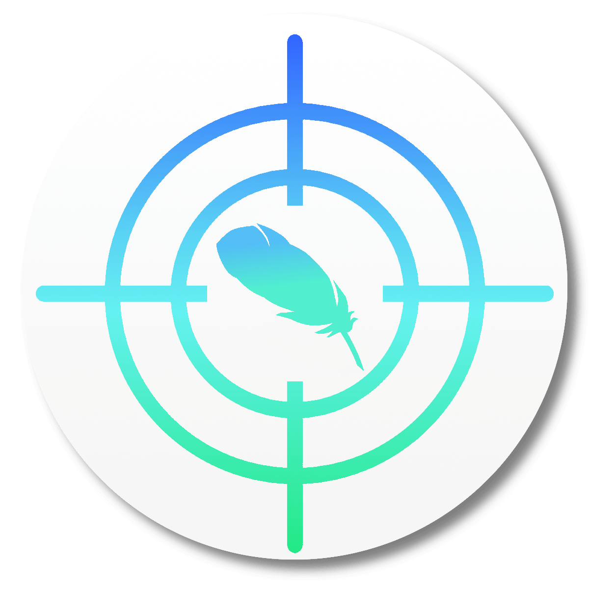
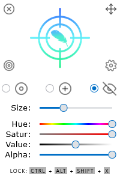
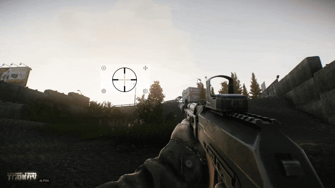

<p align="center">
  
	<center><h1>CrossOver<sup><i>lite</i></sup></h1></center>
</p>

**CrossOver<sup><i>lite</i></sup>** is a <u>lightweight</u>, adjustable crosshair overlay for Windows.  Much like **[CrossOver](https://github.com/lacymorrow/crossover)**, its predecessor, it:

- 🎯 Perfects your aim
- 🌟 Enhances your game's default crosshairs
- 🏆 Provides you with a competitive advantage
- 📊 Offers color options for better visibility
- 👁️ Aids with colorblindness

<p align="center">
	<center><h1><a href="https://github.com/girkovarpa/crossover-lite/releases">👉 Download for Windows 👈</a></h1></center>
</p>

<p align="center">
  
</p>

# Usage 📖

## Mouse 🖱️

| Description                               | Action                                                          |
| ----------------------------------------- | --------------------------------------------------------------- |
| Center the crosshair window on the screen | <kbd>Double-click</kbd> the crosshair                           |
| Close the window                          | <kbd>Click</kbd> the <kbd>ⓧ</kbd> button                        |
| Move the window                           | <kbd>Click</kbd> + <kbd>Drag</kbd> the <kbd>✣</kbd> button      |
| 🎯 Choose a default crosshair              | <kbd>Click</kbd> the <kbd>◎</kbd> button                        |
| 🎯 Load a custom crosshair                 | <kbd>Drag</kbd> + <kbd>Drop</kbd> an image file onto the window |
| Toggle the settings menu                  | <kbd>Click</kbd> the <kbd>⚙</kbd> button                        |

## Keyboard ⌨️

| Description                       | Keys                                                                 |
| --------------------------------- | -------------------------------------------------------------------- |
| Move the crosshair a single pixel | <kbd>Control</kbd>-<kbd>Alt</kbd>-<kbd>Shift</kbd>-<kbd>Arrows</kbd> |
| Lock the crosshair in place       | <kbd>Control</kbd>-<kbd>Alt</kbd>-<kbd>Shift</kbd>-<kbd>X</kbd>      |
| Center the crosshair window       | <kbd>Control</kbd>-<kbd>Alt</kbd>-<kbd>Shift</kbd>-<kbd>C</kbd>      |
| Show the **About** window         | <kbd>Control</kbd>-<kbd>Alt</kbd>-<kbd>Shift</kbd>-<kbd>A</kbd>      |

<p align="center">
  
</p>

# Building 🔨

Install [Rust](https://www.rust-lang.org/learn/get-started) if you haven't already.

Place [packfolder.exe](https://github.com/c-smile/sciter-js-sdk/blob/main/bin/windows/packfolder.exe) in this folder.

Run the following command in a console window:

```bash
cargo build --release
```

This will output an executable in `target/release`.  

To run, it must be in the same folder as [sciter.dll](https://github.com/c-smile/sciter-js-sdk/blob/899e2294b04980c793f06fb419f4bbf3641f7e71/bin/windows/x64/sciter.dll), [ahk/hotkeys.exe](ahk/hotkeys.exe), [crosshairs](crosshairs), and [LICENSE.txt](LICENSE.txt).

[ahk/hotkeys.exe](ahk/hotkeys.exe) must be compiled from [ahk/hotkeys.ahk](ahk/hotkeys.ahk) with [AutoHotKey](https://www.autohotkey.com/download/ahk-install.exe).

# Bugs 🐛

- The program is somewhat unresponsive for a couple seconds after launch while it loads all the crosshairs.
- Dragging via the <kbd>✣</kbd> button cannot be done too quickly, else the the window gets left behind.

# Credits 🏅

<table>
  <tr style="vertical-align: bottom;">
		 <td align="center"><a href="https://github.com/lacymorrow"><br /><sub><b>Lacy Morrow</b></sub></a><br />
		 creator of the original <a href="https://github.com/lacymorrow/crossover">🎯 CrossOver</a>
    <td align="center"><a href="https://sciter.com"><br /><sub><b><a href="https://github.com/c-smile/sciter-js-sdk">Sciter.JS</a></b></sub></a><br />
		the HTML/CSS/JS engine behind the software
		<td align="center"><a href="https://github.com/MustafaHi"><br /><sub><b>MustafaHi</b></sub></a><br />
		 writer of the <a href="https://github.com/MustafaHi/Sciter-MovableView"><kbd>✣</kbd> MovableView</a> script
		<td align="center"><a href="https://www.autohotkey.com"><br /><sub><b>AutoHotKey</b></sub></a><br />
		made hotkey and lock functionality possible
		<td align="center"><a href="https://kenney.nl/"><br /><sub><b>Kenney</b></sub></a><br />
		for their <a href="https://kenney.nl/assets/crosshair-pack">crosshair pack</a>
		<td align="center"><a href="https://old.reddit.com/r/IrisFlame"><sub><b>🔥 IrisFlame</b></sub></a><br />
		for other crosshairs
  </tr>
</table>

<p align="center">
	<center><h1><a href="https://github.com/girkovarpa/crossover-lite/releases">📥 Download 📥</a></h1></center>
</p>